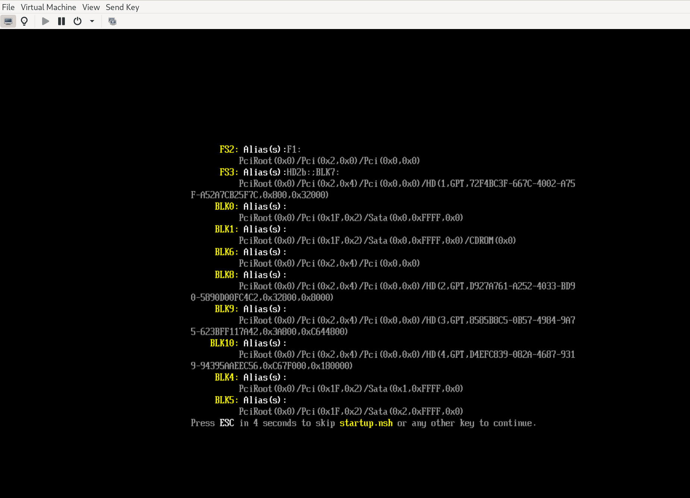

# Accessing VM with Virt-Manager

[Virtual Machine Manager](https://virt-manager.org/) is a GUI for managing virtual machines. You can use this to manage your new windows VM.
Following these steps 

1. Install virt-manager `sudo apt install virt-manager`
2. Open virt-manager (just search for it in gnome)
3. Click the "Add Connection" button
4. Select "QEMU/KVM"
5. Select "Connect to remote host over SSH"
6. enter the SSH username as root and the host as `localhost`
7. Click "Connect"

You should now see your windows VM in the list. Double click the VM to open a graphic console. 
Now you can install Windows by following the installation instructions. 

### Post Install
Once you have windows installed follow [this guide](./doc/windows-postinstall-setup.md) to configure windows to work with the host machine.

# Tips 

### Strange boot screen
If you see a screen like this

Then you have booted into the UEFI shell. You can exit the shell by typing `exit` and pressing enter.
This will present you with a UEFI menu. Select "Continue" to continue boot.
