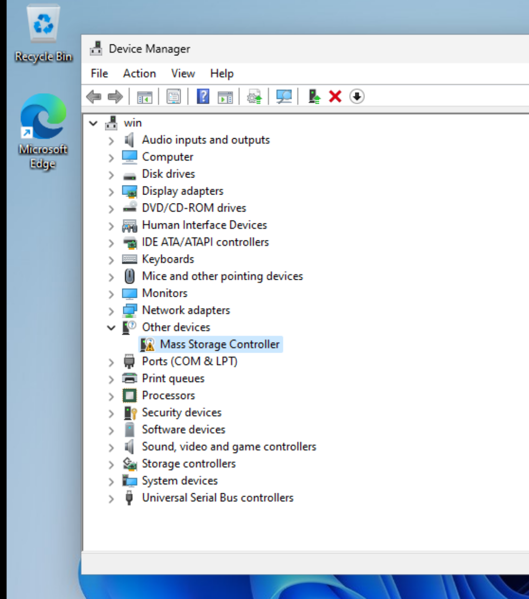
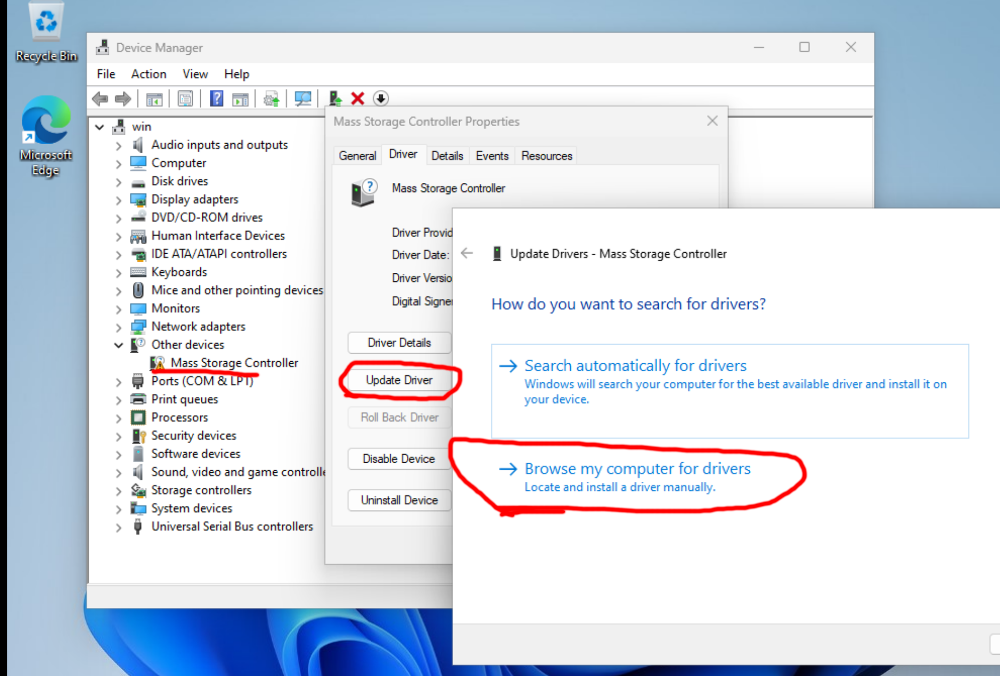
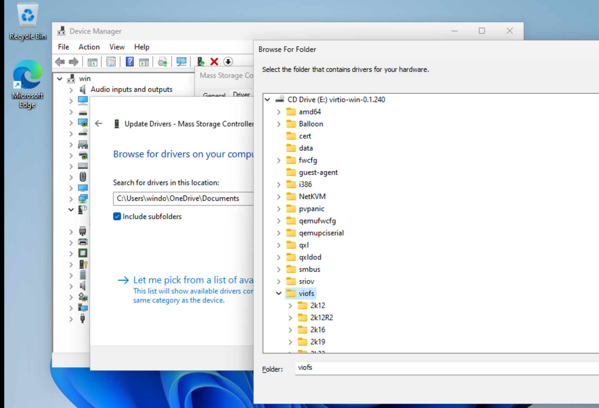

# Windows Post Install Setup

At this point you should have a running windows VM. However, you will need to configure 
windows so that it works correctly with the host machine.

## Install Guest Additions
Some scripts are provided to make guest tool installation easier.
Navigate to the scripts CD drive as shown below.

Run both the batch files in this directory as `ADMINISTRATOR`. The scripts will install spice guest tools and virtiofs drivers.

## Configure Devices 

Next you must configure system devices to use the correct drivers. In "Device Manager" locate the 
"Mass Storage Controller" device with a warning icon next to it, as shown below.

Select this device and click "Update Driver". 

Select "Browse my computer for drivers". Select the `virtiofs` driver on the `virtio-win` CD drive, as shown below.
Be sure to select the version of the driver that matches your version of Windows.

Now do the same thing but this time for the `VirtIO Serial Driver` device. This device can be found under `System Devices`.
When selecting the driver from disk, be sure to select the `vioserial` driver on the `virtio-win` CD drive.

Once the drivers are installed you should reboot Windows. After the reboot you should be able to see the shared linux drive 
in File Explorer under the "Z:" drive. Additionally the mouse should now be much more responsive as well as copy & past
should now be working.

## Switch to local account 
To make the windows VM more durable. You might want to switch to a local account. Using a local account will bypass 
all the silly "Can't use PIN" because of "Security Policy" nonsense. To do this follow these steps.

2. Search for "Your Info" in the start menu
3. Click "Sign in with a local account instead"
4. Follow the prompts to switch to a local account

## Backup Your Disk

Now that you have a working windows VM you should make a backup of the disk. This way you can make many duplicate window containers (VMs)
with `win-crate` while avoiding the long windows install process. I would provided my base disk but I don't think Microsoft would like 
that very much 😛. Backing up your disk is simple. 

1. Shutdown the VM
2. Copy the disk image under `vm/disk/windows.qcow2` to another location.

Now you can setup another windows instance by simply cloning this repo to another location and placing your windows disk in the `vm/disk/` directory of the fresh clone. Then just start with `run.sh` as per normal. BAM! Another windows VM.
