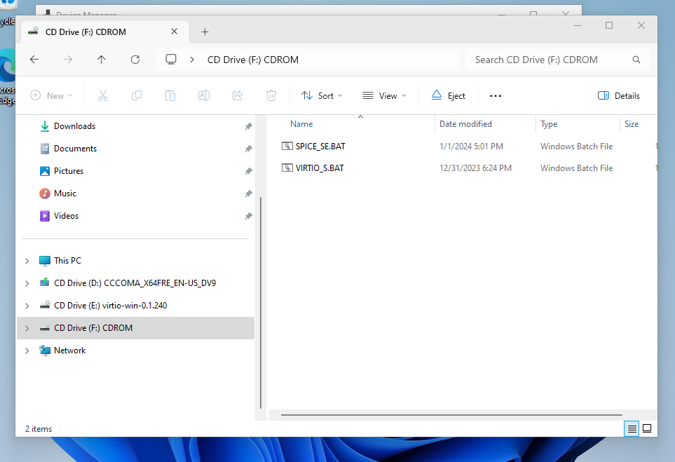
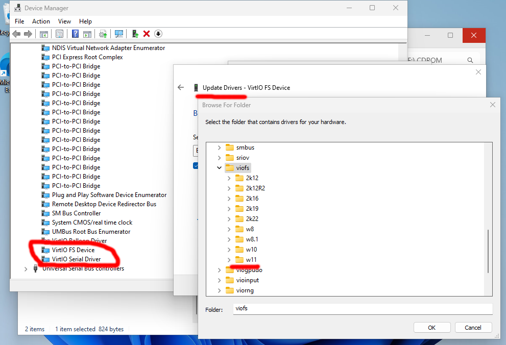

# Windows Post Install Setup

At this point you should have a running windows VM. However, you will need to configure 
windows so that it works correctly with the host machine.

## Install Guest Additions
Some scripts are provided to make guest tool installation easier.
Navigate to the scripts CD drive as shown below.

Run both the batch files in this directory. The scripts will install spice guest tools and virtiofs drivers.

## Configure Devices 

Next you must configure system devices to use the correct drivers. In "Device Manager" locate the 
"VirtIO FS Device" and "VirtIO Serial Device" and update the drivers to use the drivers on the virtio CD drive.
Use the `viofs` driver for the "VirtIO FS Device" and the `vioserial` driver for the "VirtIO Serial Device".

Once the drivers are installed you should reboot Windows. After the reboot you should be able to see the shared linux drive 
in File Explorer under the "Z:" drive. Additionally the mouse should now be much more responsive as well as copy & past
should now be working.